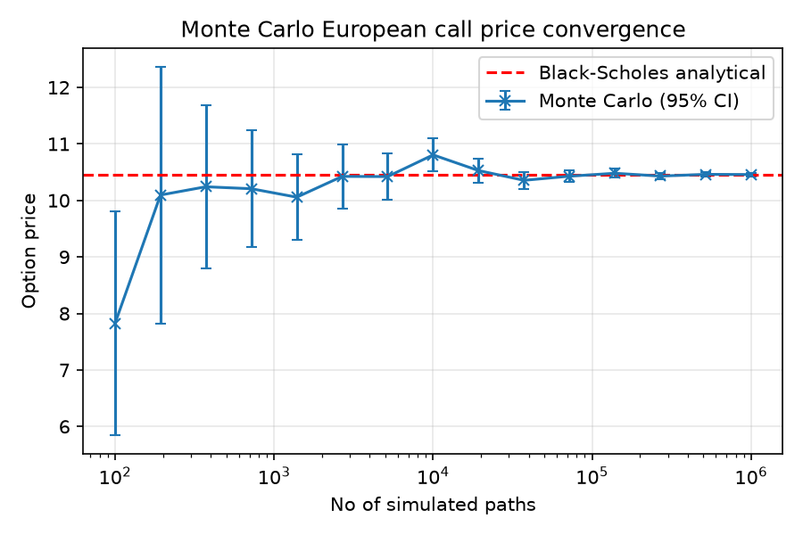
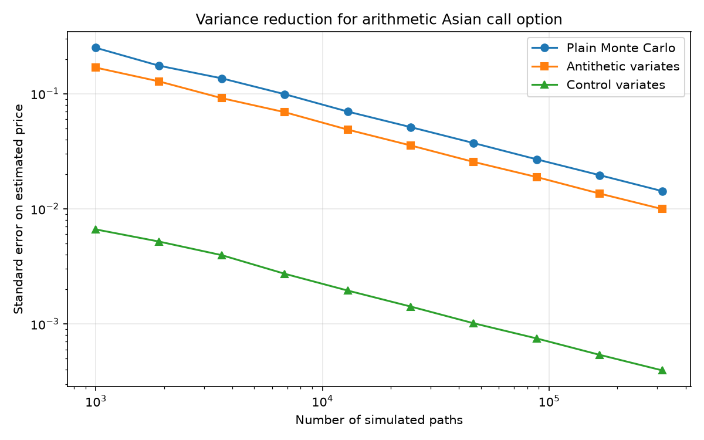
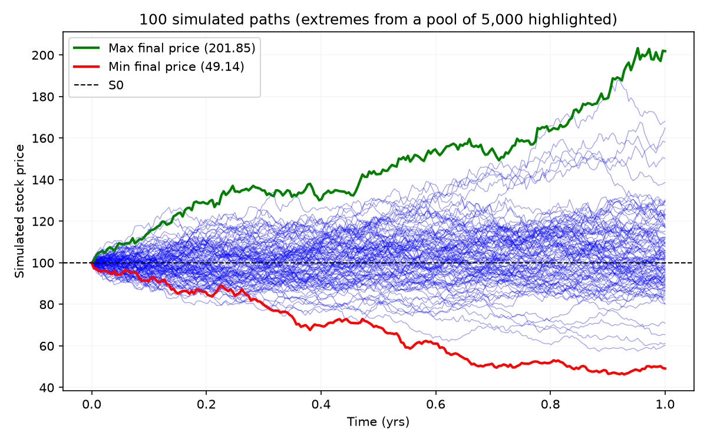

# Monte Carlo Options Pricer

A Monte Carlo program for pricing European and Asian call options, extended with applications of variance reduction techniques and 
validation against analytical solutions.

## Background

This project prices two separate options:

- **European call**: Priced with terminal price simulation, and validated against exact solution given by the Black-Scholes equation

- **Asian call**: Priced with full path simulation as the payoff depends on the option's average price over its lifetime.
  There exists no exact solution to the real arithmetic-average version, and so the analytical solution to the
  geometric-average version is used for validation (and later implemented as a control variate)

Additionally, two variance reduction techniques (antithetic variates and control variates) are implemented and compared with the plain 
Monte Carlo simulation

## Results

- **European call convergence**: The Monte Carlo price (10.4577) converges to the Black-Scholes analytical price (10.4506) after
  1,000,000 simulated paths

  *European call convergence:*
   


- **Geometric Asian call validation**: Monte Carlo price is consistent with the analytical solution within statistical noise. Additionally, the arithmetic price is greater than the geometric price, as expected by the AM-GM inequality (arithmetic mean $\geq$
  geometric mean for any set of positive numbers)
  
- **Variance reduction**: At 200,000 paths, antithetic variates reduce the standard error by ~30%, and control variates (utilising
  the correlation between the geometric and arithmetic Asian payoffs) reduce the standard error by ~97%

  *Variance reduction:*
   

- **Sample of simulated paths**: Display of 100 simulated price paths, with the minimum and maximum final values (from a
  sample of 5000) highlighted, demonstrating that extreme outcomes tend to be the result of a consistent trend away from the starting
  price, and not the result of sudden spikes

  *Sample of simulated paths:*
   

## Method

The stock price is modelled as Geometric Brownian Motion under the risk-neutral measure:

$$d S_t = r S_t dt + \sigma S_t d W_t$$

- Terminal prices of the European call option are taken directly from the analytical GBM solution
- Paths for the Asian call option are constructed by time-stepping and accumulating log returns before exponentiating back to the prices

**Variance Reduction**

- **Antithetic variates**: For every path simulated with random normal draw $Z$, its mirror path is simulated with $-Z$, and the two 
payoffs are averaged before averaging across pairs. This helps to cancel out some noise in the simulation

- **Control variates**: As the geometric Asian call option has an analytical solution, we can use the error observed in the Monte 
Carlo estimate of this price to correct some of the error in the estimated price of the arithmetic Asian call option

## Limitations

- **Slow convergence**: The 95% confidence interval shrinks as $\frac{1}{\sqrt N}$, meaning that to halve the error we need 4x the
  number of simulations

- **Simplified assumptions**: The simulation relies upon the assumption that the option price exactly follows Geometric Brownian Motion
  with constant volatility, which is not the case in the real world


## Setup

```bash
pip install numpy scipy matplotlib
```

## Run

```bash
python monte_carlo.py
```

## Possible Extensions

- Compare against a physics-informed neural network (PINN) solving the Black-Scholes PDE (accuracy vs compute time tradeoffs)
- Compute option Greeks
